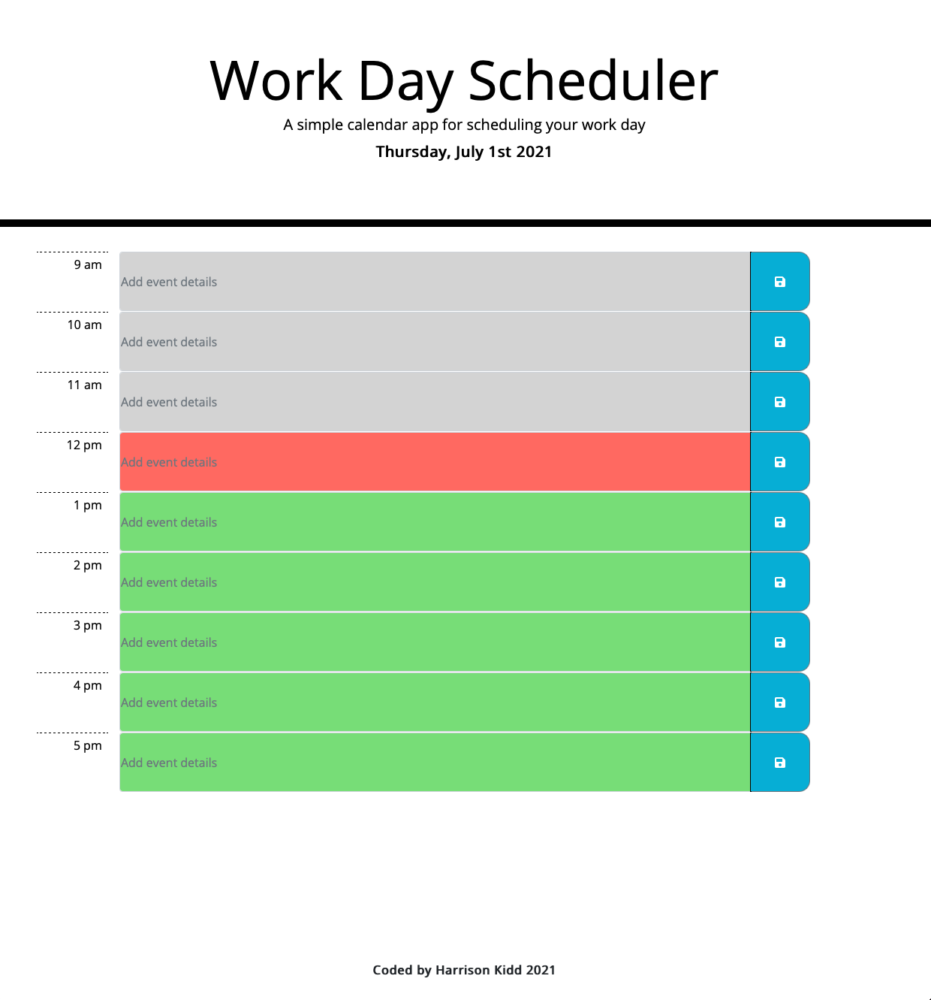

# WorkDayScheduler
Simple planner application that allows a user to save events for each hour of the day by modifying starter code. <br>

Link to deployed webpage: https://hkidd.github.io/WorkDayScheduler_HW5/

## Purpose
The purpose of this homework assignment was to build a functional work day planner with timeblocks for each hour that change color depending on the time of day.  This activity relied heavily on getting JavaScript, jQuery, Bootstrap, and Moment.js working together correctly along with saving to local storage.<br>

## Acceptance Criteria
```
GIVEN I am using a daily planner to create a schedule

WHEN I open the planner
THEN the current day is displayed at the top of the calendar

WHEN I scroll down
THEN I am presented with timeblocks for standard business hours

WHEN I view the timeblocks for that day
THEN each timeblock is color coded to indicate whether it is in the past, present, or future

WHEN I click into a timeblock
THEN I can enter an event

WHEN I click the save button for that timeblock
THEN the text for that event is saved in local storage

WHEN I refresh the page
THEN the saved events persist
```
<br>

## The bulk of the challenge
The main challenge with this assignment was to create an array of all of the timeblocks on the page, and then looping through those based on the time of day.  Depending on what hour of the day (1-24) is returned from Moment.js, the background of each timeblock changes.<br>

## Example
Representative screenshot if the time of day was 12pm (hour 12):


<br>

## End result
Using Moment.js, the time of day (hour) is accurately represented using the displayed timeblocks after looping through them all.<br>

Each timeblock has an input field with a functioning save button on the right side.  When the save button is clicked, the input text value is saved to local storage.<br>

Upon page load, if there are values saved to local storage for each of the individual blocks, they are retrieved and displayed inside the text fields.<br>

## Made with the help of + references
Previous boot camp exercises (Bootstrap, moment.js, event delegation, local storage, DOM manipulation) <br>
Jacob Guiro <br>
<br>

MDN Docs <br>
W3 Schools <br>


## License
[MIT](https://choosealicense.com/licenses/mit/)
<br>

## Contact
Harrison Kidd <br>

harrisonakidd@gmail.com 
